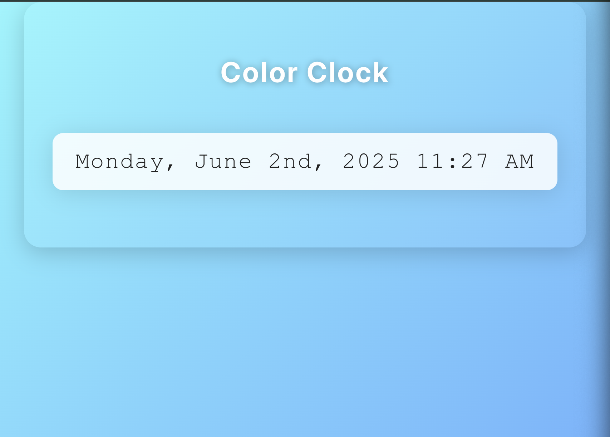

# Color Clock

A colorful digital clock built with React and Vite. Displays the current date and time, updating every second.

## Features

- Live updating clock using React state
- Date and time formatting with [date-fns](https://date-fns.org/)
- Custom gradient and color styling

## Getting Started

1. Clone the repository
2. Install dependencies:  
   `npm install`
3. Start the development server:  
   `npm run dev`
4. Open your browser to the displayed URL (usually [http://localhost:5173](http://localhost:5173))

## Dependencies

- React
- Vite
- date-fns

## Customization

Edit `src/App.css` to change the clock’s colors or layout.

## Screenshot

---

### **How it Works**

The app uses React hooks to keep the time up to date and `date-fns` for easy formatting.

---

## **Rubric Checklist**

- [x] **Functionality:**

  - [x] Clock displays the current date and time in a readable format
  - [x] Clock updates every second (dynamic/live)
  - [x] Uses `date-fns` for date and time formatting

- [x] **Styling:**

  - [x] Project has clear styling applied (not just default)
  - [x] At least one color present beyond black and white
  - [x] Layout and font are visually appealing and easy to read

- [x] **npm and Dependencies:**

  - [x] All required npm packages installed (`react`, `date-fns`, etc.)
  - [x] No missing or incorrectly used dependencies
  - [x] Project runs without dependency errors

- [x] **Documentation and Maintainability:**
  - [x] Project includes meaningful code comments
  - [x] `README.md` file with:
    - [x] Project description
    - [x] Setup and run instructions
    - [x] List of dependencies
    - [x] Screenshot of the working application
  - [x] Instructions in README are clear and easy to follow
